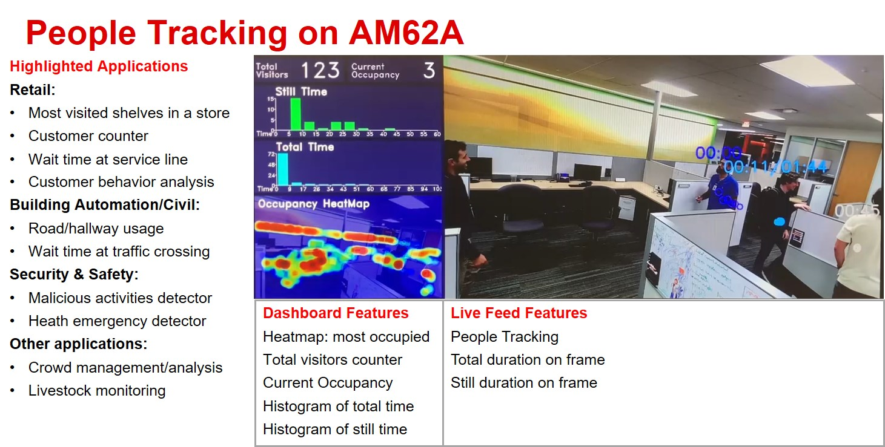

# Realtime People Tracking using Vision based Edge AI
> Repository to host GStreamer based Edge AI applications for TI devices

This repo adds a vision based people tracking support.

## Table of content
- [About People Tracking Demo](#about-people-tracking-demo)
- [Supported Devices](#supported-devices)
- [EVM Setup](#evm-setup)
- [Demo Setup and Running](#demo-setup-and-running)
- [Result](#result)
- [Basic Summary of the Code Changes](#basic-summary-of-the-code-changes)
- [Resources](#resources)

## About People Tracking Demo
This demo uses **[AM62A](https://www.ti.com/tool/SK-AM62A-LP)** to run a vision-based artificial intelligent model for people tracking. Vision-based people tracking has applications in several fields such as retail, building automation, security and safety. This demo utilizes YOLOX-S-Lite machine learning model to detect individuals in the video stream. The output of this model is used to track people moving within the scene. An open source library, **[Norfair](https://github.com/tryolabs/norfair)**, is used for people tracking. This demo is implemented on AM62A SOC and it can be seamlessly ported to run on other AM6xA devices.

The demo offers live tracking of individuals in the scene with timers indicating the duration they spent at their current location. In addition, it features a dashboard presenting several statistics such as the total number of visitors, the current occupancy and the distribution of the time individuals spent in the scene. The demo also includes a heatmap highlighting frequently visited areas. This feature provides insights to understand human behavior which has applications in several industries. For instance, the heatmap data can inform the rearrangement shelf layout at retail stores to enhance customer experience.


See [Resources](#resources) for links to AM62A and other Edge AI training material.

## Supported Devices

| **DEVICE**              | **Supported**      |
| :---:                   | :---:              |
| AM62A                   | :heavy_check_mark: |

## EVM Setup

Follow the [AM62A Quick Start guide](https://dev.ti.com/tirex/explore/node?node=A__AQniYj7pI2aoPAFMxWtKDQ__am62ax-devtools__FUz-xrs__LATEST) for the [AM62A Starter Kit](https://www.ti.com/tool/SK-AM62A-LP)
* Download the [Edge AI SDK](https://www.ti.com/tool/download/PROCESSOR-SDK-LINUX-AM62A) from ti.com. 
    * Ensure that the tisdk-edgeai-image-am62axx.wic.xz is being used.
* Install the SDK onto an SD card using a tool like Balena Etcher.
* Connect to the device (EVM) and login using a UART connection or a network connection through an SSH session.

## Demo Setup and Running
1. Clone this repo in your target under /opt

    ```console
    root@am62axx-evm:/opt# git clone https://github.com/TexasInstruments/edgeai-gst-apps-people-tracking
    root@am62axx-evm:/opt# cd edgeai-gst-apps-people-tracking
    ```

2. Run the setup script below within this repository *on the EVM*. This requires an internet connection on the EVM. 
*  An ethernet connection is recommended. 
*  Proxy settings for HTTPS_PROXY may be required if the EVM is behind a firewall.

    ```console
    root@am62axx-evm:/opt/edgeai-gst-apps-people-tracking# ./setup-people-tracking.sh
    ```

    This script will download the following:
    * Download the YOLOX-S-LITE model and install it under /opt/model_zoo in the filesystem, if it is not already installed.
    * Install the Norfair tracking library. 


3. Run commands as follows from the base directory of this repo on the EVM.

    ```console
    root@am62axx-evm:/opt/edgeai-gst-apps-people-tracking# cd apps_python
    ```

   * To run the demo using a camera as input:
    ```console
    root@am62axx-evm:/opt/edgeai-gst-apps-people-tracking/apps_python# ./app_edgeai.py ../configs/people-detection.yaml
    ```

## Result
The application shows two main sections on the screen: live feed of the input video and a graphical dashboard. The live video is overlaid with total and still duration data and the history of the movement. The dashboard graphically shows an overview of the total visitors and the current occupancy. It also shows two hisogram graph bars for analyzing the total and still durations. The bottom of the dashboard shows a heatmap over lay on the scene based on the history of all detected individuals. The figures belewo shows a screenshot of the demo and provides details about the view and possible applications.


## Basic summary of the code changes
* **apps_python**:
  * Add a new post process class for people tracking in post_process.py.
  * Add a new dashboard class in dashboard.py to generate graphical representation of data.
  * Add a new ObjectTime and ObjectTimeCount in object_time_count.py to count total time and still time for each tracket object.
  * add a new calss HeatMap in heat_map.py to generate heatmap based on history of all detected objects and overlay on input frame.
  * 
* **apps_cpp**:    Not changed in this version
* **configs**:     Create two new config files:
  * /configs/people_tracking.yaml to run the demo using a CSI or a USB camera feed as input. 

## Resources


| Purpose | Link/Explanation | 
| ------- | ----- | 
|AM62A product page (superset) | https://www.ti.com/product/AM62A7 
| AM62A Starter Kit EVM | https://www.ti.com/tool/SK-AM62A-LP 
| EVM Supporting documentation | https://dev.ti.com/tirex/explore/node?node=A__AA3uLVtZD76DOCoDcT9JXg__am62ax-devtools__FUz-xrs__LATEST
| Master Edge AI page on Github |  https://github.com/TexasInstruments/edgeai 
| Edge AI Cloud | https://dev.ti.com/edgeaistudio/
| Model Analyzer | Allows viewing of benchmarks and real-time evaluation on a 'server farm' of Edge-AI capable EVMs https://dev.ti.com/edgeaisession/
| Model Composer | Allows data capture, data labelling, model selection, model training, and model compilation https://dev.ti.com/modelcomposer/
| Edge AI Academy for new developers | https://dev.ti.com/tirex/explore/node?node=A__AN7hqv4wA0hzx.vdB9lTEw__EDGEAI-ACADEMY__ZKnFr2N__LATEST
| AM62A Processor SDK | https://www.ti.com/tool/PROCESSOR-SDK-AM62A
| Edge AI Linux SDK Documentation | https://software-dl.ti.com/jacinto7/esd/processor-sdk-linux-edgeai/AM62AX/latest/exports/docs/devices/AM62AX/linux/index.html
| AM62A Academy | https://dev.ti.com/tirex/explore/node?node=A__AB.GCF6kV.FoXARl2aj.wg__AM62A-ACADEMY__WeZ9SsL__LATEST
| AM62A Design Gallery | https://dev.ti.com/tirex/explore/node?node=A__AGXaZZe9tNFAfGpjXBMYKQ__AM62A-DESIGN-GALLERY__DXrWFDQ__LATEST
| e2e Support Forums | https://e2e.ti.com


